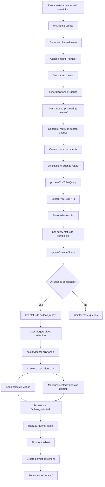

# WhyTV Firebase Cloud Functions Flow

This document outlines the flow of Firebase Cloud Functions that power the WhyTV application, which provides a TV-like experience for users to watch endless videos powered by YouTube.

## Overview

WhyTV uses a series of Firebase Cloud Functions to:
1. Create channels based on user descriptions
2. Generate search queries for YouTube videos
3. Process these queries to find relevant videos
4. Select the most appropriate videos for the channel and mark others as deleted
5. Order these videos into a cohesive playlist

## Function Flow Diagram

## Detailed Function Descriptions

### 1. onChannelCreate
- **Trigger**: When a new document is created in the `channels` collection
- **Purpose**: Initialize a new channel with AI-generated name and unique channel number
- **Actions**:
  - Generate a creative channel name using Gemini AI
  - Assign a unique channel number
  - Set initial status to 'new'

### 2. generateChannelQueries
- **Trigger**: When a channel document is updated with status 'new'
- **Purpose**: Generate search queries to find relevant YouTube videos
- **Actions**:
  - Generate 15-20 diverse search queries using Gemini AI
  - Create query documents in the channel's queries subcollection
  - Update channel status to 'queries ready'

### 3. processYouTubeQuery
- **Trigger**: When a new query document is created
- **Purpose**: Execute YouTube API search and store results
- **Actions**:
  - Search YouTube using the query text
  - Store video results in the channel's videos subcollection
  - Update query status to 'completed'

### 4. updateChannelStatus
- **Trigger**: When a query document is updated to 'completed' status
- **Purpose**: Check if all queries are completed and update channel status
- **Actions**:
  - Check if all queries for the channel are completed
  - If all completed, update channel status to 'videos_ready'

### 5. selectVideosForChannel
- **Trigger**: When a channel document is updated with status 'select_videos'
- **Purpose**: Select the best videos for the channel from all query results and mark others as deleted
- **Actions**:
  - Pass all video objects to Gemini AI
  - AI returns only the YouTube IDs of videos that should be kept
  - Update selected videos with `deleted: false`
  - Mark unselected videos with `deleted: true`
  - Update channel status to 'videos_selected' with counts of selected and deleted videos

### 6. finalizeChannelPlaylist
- **Trigger**: When a channel document is updated with status 'videos_selected'
- **Purpose**: Create a cohesive, ordered playlist from selected videos
- **Actions**:
  - Use Gemini AI to order videos for optimal viewing experience
  - Create a playlist document with the ordered videos
  - Update channel status to 'created'

## Status Flow

Channel statuses flow in this order:
1. `new` - Initial status after channel creation
2. `processing queries` - Generating search queries
3. `queries ready` - Queries generated and ready for processing
4. `videos_ready` - All queries processed and videos found
5. `select_videos` - Triggered by user to select videos
6. `videos_selected` - Videos selected and ready for playlist creation
7. `created` - Final status after playlist creation

## Error Handling

Each function includes error handling that:
- Logs detailed error information
- Updates the relevant document status to 'error'
- Includes error details in the document 
